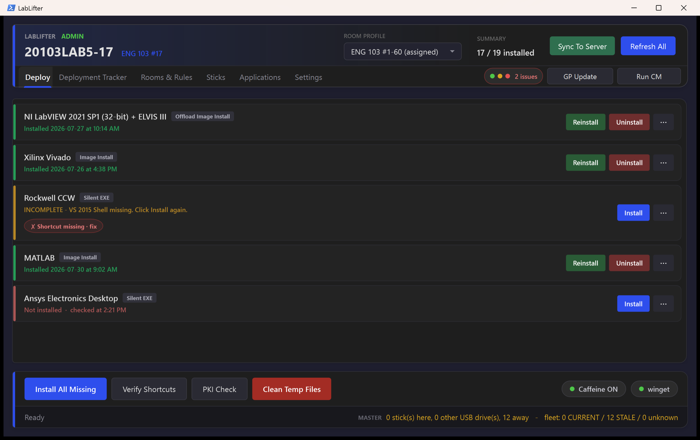
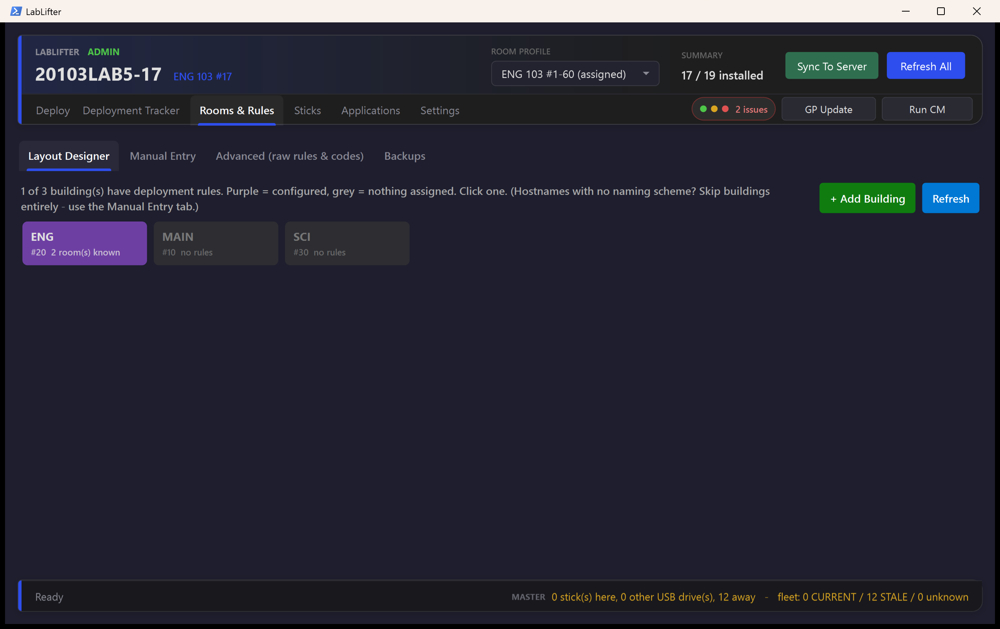
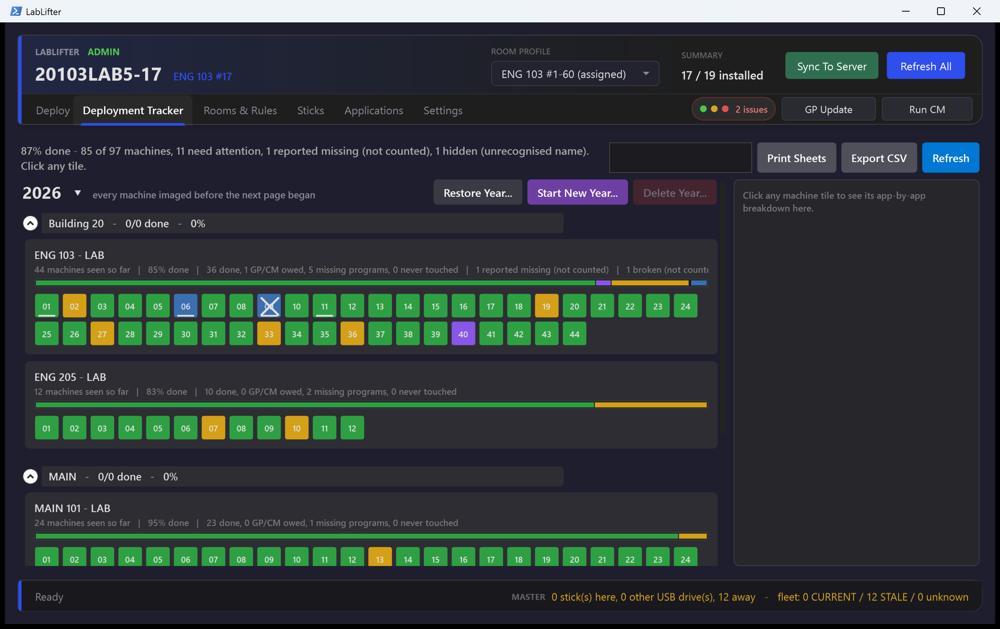
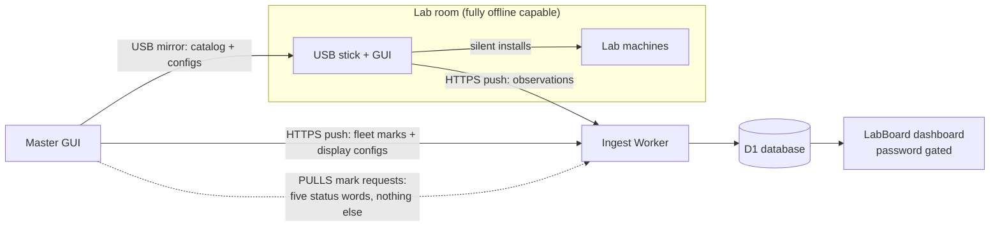

# LabLifter

Deployment tooling for the installers you dread: the gap Intune can't cover.

Ordinary software, browsers, utilities, anything with a clean silent MSI, mass-deploys
through Intune or SCCM and never needs a human. Heavyweight engineering and science
software doesn't work that way: MATLAB, LabVIEW, Vivado, Ansys come as 5-30 GB
installers with licence servers, activation wizards, installers that detach or fail
silently, and apps that must be opened once before they count as working. Someone still
has to stand at the machine.

LabLifter lives in exactly that middle ground: **a smart checklist on a USB stick**.
Every application is a card that re-detects its true state on every scan. One click runs
everything that *can* be automated: silent install, licence-code injection, dependency
ordering, PATH repair, shortcuts. The card stays honestly red or amber until the
few genuinely human steps are done too. The tech stops memorizing runbooks; the checklist
carries them.

Built and used in production to image and maintain **250+ lab machines across 14 rooms**,
deploying an **[81-application catalog](docs/SUPPORTED-APPS.md)** ranging from a 200 KB
driver to a 30 GB EDA suite. The whole tool is a single 20,000-line PowerShell 5.1 / WPF
application, plus a receive-only telemetry plane on Cloudflare (Workers + D1 + Pages)
that puts the fleet's install status on one dashboard wall.

## Screenshots


*The Deploy tab: per-app cards re-detected on every scan, installed (green), incomplete with a one-click shortcut fix (amber), missing with a silent Install (red). Machine health pill top-right; imaging/CM/PKI checks are per-room configurable.*


*The Layout Designer (Rooms & Rules): every building the hostname decoder knows, purple when it carries deployment rules. Click through to assign per-machine-range app sets on a visual ruler.*


*The Deployment Tracker: every machine in every room as a tile, same palette as the dashboard wall. Green done, yellow partial, purple owes GP/CM, blue reported missing, an X for broken, grey never seen.*

## Why it's built this way

LabLifter is a complement to Intune/SCCM, not a replacement, the easy 90% of software
should keep flowing through those. This tool exists for the installs they can't carry:
payloads too big to pull over lab networking (some rooms are effectively air-gapped),
vendors with no working silent mode, licences that live on a wizard page. That niche
inverts the usual design:

- **The USB stick is the source of truth.** GUI, configs, and installer payloads travel
  on sticks. A tech plugs in, sees red/green cards, clicks install. No agent, no domain
  dependency, no cloud requirement, the tool is fully functional with zero connectivity.
- **Telemetry is strictly one-way, up.** Sticks push observations to a Cloudflare Worker;
  the dashboard renders them. The server **cannot** push configs, cards, code, or
  commands to anything, not by policy, by construction: the only downstream verbs in
  the entire protocol are five status words (`verified / override / missing / broken /
  clear`), pulled, never pushed, by the master, and only ever displayed to humans.
- **Detection is ground truth, not bookkeeping.** Every card re-detects on every scan
  (registry, file byte-compare, real machine PATH from the registry hive, …), so the
  GUI reports what *is*, not what some past run claimed to have done.



Every solid arrow points away from the fleet. The only thing that ever comes back
is the dashed pull, and it can carry nothing but the five status words.

## Highlights

- **81-card app catalog, 80 fully silent**: NSIS, Inno, MSI, InstallShield, Office
  Deployment Tool, DISM features, driver packages, raw file deploys. Per-card automation
  includes dependency chains (install Java before Maven, automatically), licence-code
  injection from a gitignored local file, registry-level system PATH repair that
  preserves `REG_EXPAND_SZ` (where `setx` would truncate at 1024 chars), and
  first-launch tracking for apps that need a one-time opening. All but one card
  install from natively staged payloads - **no winget, no internet needed**.
  Full list with per-card automation flags:
  **[docs/SUPPORTED-APPS.md](docs/SUPPORTED-APPS.md)**.
- **The catalog grows from inside the GUI**: a capture wizard runs any installer
  while snapshotting the machine and writes the card (detection included), and an
  ADD FROM WINGET flow adds any winget package: debounced live search with
  suggestions, `--exact` always, and silent / machine-scope / agreement switches as
  per-card checkboxes. Both produce real file/registry detection, so scans never
  depend on winget or the network.
- **46 documented error codes** ([gui/ERROR-CODES.md](gui/ERROR-CODES.md)), a tech
  reports "E21 on LabVIEW" and remote diagnosis is possible without screen-sharing.
- **Hostname-aware fleet model, with a universal fallback**: machine names parse
  as `[building][room][TYPE][refresh]-[machine]`, driving per-room app profiles
  and deployment rules with zero per-machine configuration. Fleets whose hostnames
  carry **no scheme at all** use the assignment ledger instead (Rooms & Rules →
  Manual Entry): assign machines to rooms once by hand, number them manually or by
  first-seen walk order (a tech walks the room with a stick and the walk order IS
  the numbering), swap two numbers in one click, and freed numbers are never
  silently reused.
- **Time-machine dashboard**: D1 keeps append-only observations, so the wall can
  replay the fleet's state as of any past day.
- **Defensive engineering throughout**: every config the engine reads is linted by
  [`gui/tests`](gui/tests) (29 test files); the fold logic that turns raw observations
  into the wall is covered by a Node test suite in the companion LabBoard repo;
  hostile inputs (a machine's PATH, a vendor installer's exit codes) are treated as
  untrusted and can't take down a scan.

## Inside the app, tab by tab

**Deploy**: the field face, the only tab a lab tech needs. One card per
application: green (detected, with version and install date), amber (installed but
incomplete, shortcut missing, first launch unconfirmed), red (missing; one click
installs silently). *Install All Missing* runs the whole room in dependency order.
The health pill watches imaging date, management client, and machine certificate -
per-room configurable, down to two dots for rooms that never get certs.

**Deployment Tracker** *(master only)*, the wall, locally: every machine in every
room as a colored tile (same palette as the LabBoard dashboard), folded from every
session log with generation awareness, a re-imaged machine owes nothing to last
year's errors. Tech marks (Verified / Override / Report missing), print sheets, CSV
export, year pages.

**Rooms & Rules** *(master)*, four sub-tabs. *Layout Designer*: buildings → rooms →
per-machine-range app assignment on a visual ruler, plus per-room health toggles.
*Manual Entry*: the assignment ledger for fleets with no naming scheme, assign by
hand, number manually or by first-seen walk order, swap two numbers in one click,
freed numbers never reused. *Advanced*: raw rules with a hostname dry-run tester.
*Backups*: named config sets and snapshots.

**Sticks** *(master)*, a slot ledger of every USB deployment stick, CURRENT or
STALE at a glance. Updates run four sticks in parallel, and every finished copy is
fingerprint-verified against staging on a background thread, a silent copy failure
paints red, never a quietly wrong CURRENT. Initialize turns a blank drive into a
numbered fleet stick.

**Applications** *(master)*, *Catalog*: enable, disable, or edit any card.
*Build New Card*: point it at an installer file **or a winget package**; the install
runs on the master while the tool snapshots the machine, so the card learns real
file/registry detection. *Update Installer*: the yearly swap-in-this-year's-setup
flow.

**Settings**: display scale (fit-to-window), scanning behavior, master-only
toggles. Saved per drive, so every stick keeps its own.

## Repository layout

| Path | What it is |
|---|---|
| [`gui/`](gui/) | The deployment tool: one-file WPF app (`Deploy-LabGUI.ps1`, ~20.7k lines), JSON config set, stick-sync scripts, test suite |
| **[LabBoard](https://github.com/ITakeCake/labboard)** (companion repo) | The telemetry plane: Cloudflare Worker (bearer-token ingest into D1) + the dashboard (Basic Auth, fleet fold, time machine, printable reports) |
| [`payloads/`](payloads/) | Sample installer-automation payloads: silent-install configs, a PATH-repair script, VS Code extension seeding |
| [`docs/SUPPORTED-APPS.md`](docs/SUPPORTED-APPS.md) | Generated catalog of all 81 apps with per-card automation flags |

## Running it

The engine's internal name is LabDeploy: the stick folder (`LabDeployment\`), the
log prefix (`LabDeploy_*.log`) and `Deploy-LabGUI.ps1` keep it as the on-disk wire
format.

The GUI runs from a clone as-is on Windows (PowerShell 5.1, admin for installs):

```bat
gui\Launch.bat
```

(`gui\Create-DesktopShortcut.bat` puts a LabLifter shortcut - purple icon and all -
on the desktop.)

The configs ship as a **starter**: the full 81-card catalog, plus a DEFAULT room
profile (auto-selected when a hostname matches nothing) and one worked example of a
room, a building, and a deployment rule. You add your own campus - buildings in
`buildings.json`, rooms visually in the Rooms & Rules Designer, cards via Build New
Card.

Placeholders are safe by design: with `config/telemetry.json` still saying `REPLACE`,
every network call is a no-op; licence codes live in `config/licences.json` (gitignored -
see `licences.example.json`); installer payloads are looked up per-card and simply show
as "source missing" (E21) until staged. Nothing crashes on a bare clone.

The telemetry plane (Worker + dashboard) lives in the **companion LabBoard repo**,
which carries its own deploy guide: create a D1 database, fill the placeholders,
`wrangler deploy`, done. The GUI needs only its URL in `config/telemetry.json`.

## Tests

```powershell
gui\tests\test-configlint.ps1        # config invariants
# the telemetry plane's Node suites live in the companion LabBoard repo
```

## License

MIT, see [LICENSE](LICENSE).
